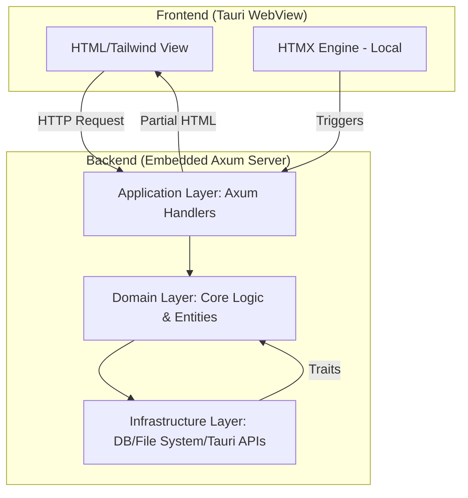

# Project Architecture: Touri (Tauri + Axum + HTMX)

This project uses a Domain-Driven Design (DDD) architecture tailored for a cross-platform Tauri application utilizing Axum for Server-Side Rendering (SSR) and HTMX for dynamic interactions.

## 🏗 System Overview

## 📂 Directory Structure

- **`src-tauri/src/domain`**: The heart of the application. Contains entities, value objects, and repository traits. Pure Rust logic with no external dependencies where possible.
- **`src-tauri/src/application`**: Axum routes, middleware, and request/response handling. This layer coordinates the domain logic to fulfill user requests.
- **`src-tauri/src/infrastructure`**: Concrete implementations of repository traits (e.g., SQLite via SQLx), external service clients, and Tauri-specific bridge logic.
- **`src-tauri/src/presentation`**: HTMX templates and static assets (Local Tailwind CSS, local HTMX JS). All UI is generated server-side.

## 🚀 Key Patterns

### Offline-First Assets
HTMX and Tailwind CSS are bundled within the application. No external CDNs are permitted to ensure the app is fully functional offline.

### Server-Side Rendering (SSR)
Axum handles the rendering of HTML fragments. HTMX swaps these fragments into the Tauri WebView, reducing the need for complex client-side state management.

### No-Unwrap Policy
The codebase enforces strict error handling. All functions that can fail must return a `Result`, and errors must be handled gracefully in the application layer to provide feedback to the UI.
